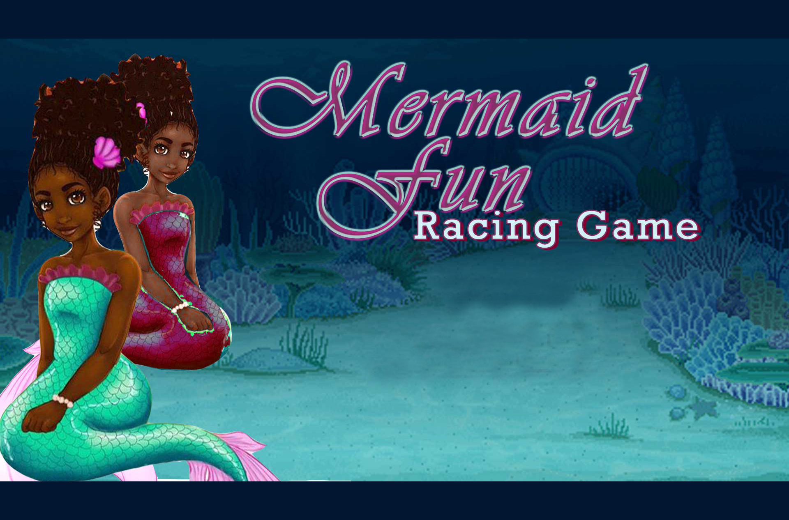

# mermaidfun
[Second Draft: With scaled-back objectives aimed at submiting a basic working Game as prof of concept]
## Project Proposal
### Due to the scope of the game as a whole, I objective is to build a proff of concept-game. I propose to work on the following milestones.

## Wireframe
#####Trimmed Down Version

## Synopsis
Title: Mermaid Fun Racing Game. [MFRG for short] - OR - [ MerFuRaG for short]
This is a javascript game that runs in the DOM.
It was inspired by suggestions from my daughters, Izzy & Tori.
This game is thus based on the specifications of my first "real life" clients!
 
## Modified Objective;
1. The [PLAYER1] objective is to collect treasurePoints while traversing an obstacle course.
2. WINNING points are based on collated point and time spent against PLAYER2 or against the computer.
3. Collision with creature[OBSTACLES] will reduce point while captured food will increase helth
4. Winners are entered into the hall of fame: archived into the scoreRecords[recordKEEPER]
5. Losers get to quit or try again [RepeatGAME]
 
## SCHEDULED (OBJECTIVES & GOALS)
Wed:
1. Wireframe        										√ Done
2. Collate & Design Game Characters 						√ Done
3. Create Pseudo Code 				        				√ Done
4. Research on How to build game tracks (js++) 				√ Done
5. MockUp Prototype 					        			√ Done
 
Thur:
1. Create HTML IntroSCREEN    				    			* WorkInProgress(WIP)
2. Create Player Assignment and Game Mode Selection [optionPage], Code (sprite)character maneuverability
3. Define Characters Objects, Classes, Functions, Game-Controls, EnergyLevels, ScoreKeepR in accordance with Mod1 project specifications.
4. Design an obstacle course for first-swim-Race [Level1: PracticeTRACK] a simple track with randomized obstacles.
 
 
Fri:
1. Build a race Track [other levels will be built for full version of the game]
2. Link all pages and modals and test for bugs as well as;
3. Responsiveness & WCAG Compatibility
 
Sat:
1. Advance javascripts scripting & testing
2. Review & Test for bugs
 
Sun:
1. Get Alpha Testers
2. Request /User Feedback
 
Mon:
1. CleanUp codes & refactor codes for efficiency
2. Push Code to master
3. Prep for Final Presentation
 
Tue:
1. Shock & Awe
 
Wed: Project.Next
 
Thur: Sleep | Eat | Code...

# mermaidfun 
[First Draft; Aimed at The Full Game Version]
 ## Project Proposal
 ### Due to the scope of the game as a whole, I objective is to build a proff of concept-game. I propose to work on the following milestones. 

## Wireframe

 
 

## Synopsis
Title: Mermaid Fun Racing Game. [MFRG for short] - OR - [ MerFuRaG for short]
This is a javascript game that runs in the DOM.
It was inspired by suggestions from my daughters, Izzy & Tori.
This game is thus based on the specifications of my first "real life" clients!

## gameInstructions: 
#####You have the option to;
1. Your[PLAYER1] objectives are to collect as many treasures as you can while racing against a friend [PLAYER2] or Herxaula[theAi].
2. You can choose to race against the time [theCLOCK] or compete based on points [capturedTREASURE]
3. You will face creatures[OBSTACLES], helpers[PowerUPs;blasterTRIDENTS,immunityCLOCKS], grid-paths[mazeTRACKS] as well as random-weather-patterns[oceanCURRENTS;earthTREMORS;heatWAVES,lavaSPILLS]
4. When you win, you get archived into the scoreRecords[recordKEEPER]
5. If you lose, you are given the option to try again[RepeatGAME]

## SCHEDULED (OBJECTIVES & GOALS)
Wed:
1. Wireframe
2. Collate & Design Game Characters
3. Create Pseudo Code
4. Research on How to build game tracks (js++)
5. MockUp Prototype

Thur:
1. Create HTML IntroSCREEN
2. Create User Authentication & Option Selection [at the very least: Create dumb buttons]
3. Define Characters Objects, Classes, Functions for Game-Physics: RandomizeObstacles, 
Gravity, Heat,Fatigue,Health,Speed,Drag,EnergyLevels,ScoreKeepR/MonitoR,voiceEffect,SoundEffects,RecordArrays,LocatoR,gPS (gamePositioningSystem)}, TrackGrid.....
4. Design a simple track with 3 randomized obstacles OR creatures with/without game physics for testing character motion.
5. Code (sprite)character maneuverability

Fri:
1. Build Tracks [Up to 6 tracks/levels]
2. Link all pages and modals and test for:
3. Responsiveness & WCAG Compatibility
4. Review Progress and Re-access Processes
5. Gap Night [Got to the movies Or something]

Sat:
1. Advance javascripts scripting & testing
2. Review & Test for bugs

Sun:
1. Get Alpha Testers
2. Request /User Feedback

Mon:
1. CleanUp codes & refactor codes for efficiency
2. Push Code to master
3. Prep for Final Presentation

Tue:
1. Shock & Awe

Wed: Project.Next

Thur: Sleep | Eat | Code...

## Wireframe

